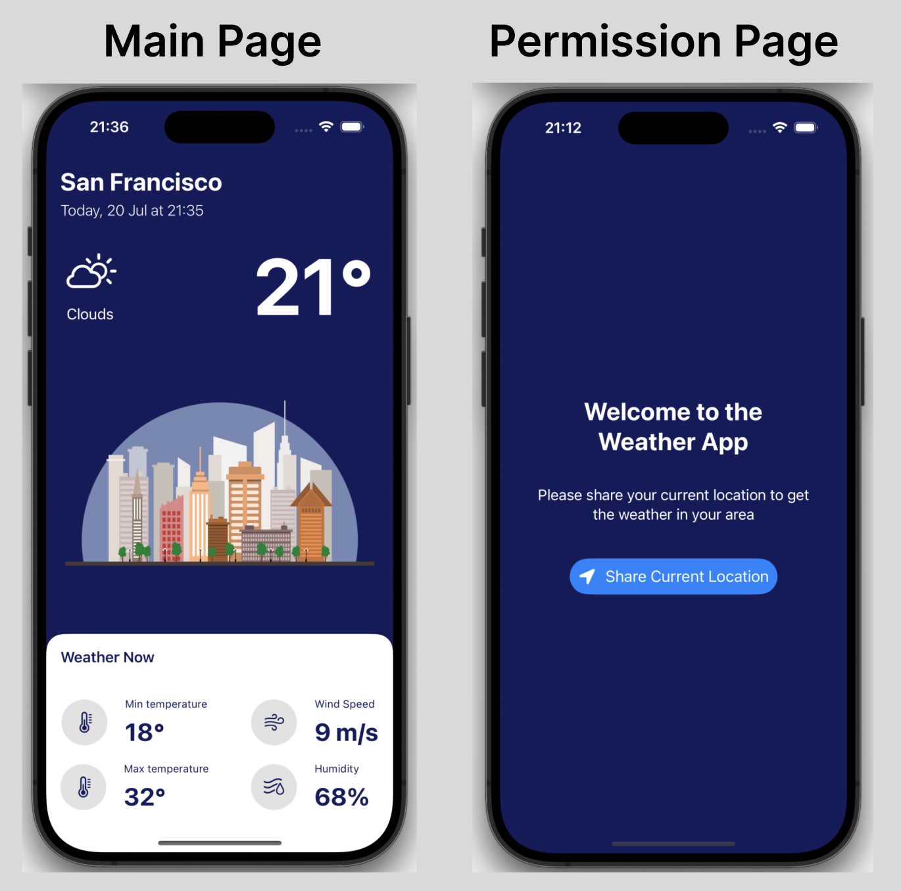

# Weather App

Welcome to the Weather App! This SwiftUI-based application provides real-time weather information for your current location using the OpenWeather API.



The Weather App offers a straightforward and user-friendly interface to check the current weather conditions in your area. By utilizing your device's location services, the app fetches and displays essential weather details, including:

- **Current Temperature**
- **Minimum and Maximum Temperature**
- **Wind Speed**
- **Humidity**

Additionally, the app provides your current location and the date and time of the latest weather update.

## Features

- **Real-Time Weather Data:** Get up-to-date weather information based on your current location.
- **Comprehensive Weather Details:** View not just the temperature, but also wind speed and humidity levels.
- **Location Information:** See your current location on the app along with the date and time of the latest weather report.
- **SwiftUI Interface:** Enjoy a sleek and modern user interface built with SwiftUI.

## Installation

To run this app on your local machine, follow these steps:

1. **Clone the Repository:**
   ```bash
   git clone https://github.com/OzgunEfe/WeatherApp.git
   
2. **Open in Xcode:**
   Open the **WeatherApp.xcodeproj** file in Xcode.
   
3. **Run the App:**
   Select your target device and click the Run button in Xcode.
   
## Usage

Upon launching the app, grant location permissions when prompted. The app will then display the current weather conditions for your location.

## Acknowledgements

- [OpenWeather API](https://openweathermap.org/api) for providing the weather data.

   
   
